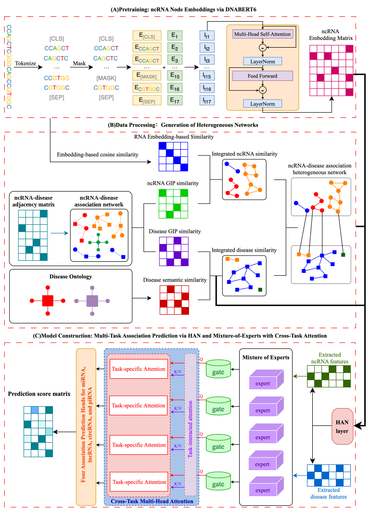

# PanGIA: A universal framework for identifying association between ncRNAs and diseases

PanGIA is a deep learning model for predicting ncRNA-disease associations.
## Model Architecture


## Installation
```bash
conda create -n pangia python=3.11
conda activate pangia
pip install -r requirements.txt
```

## Source of Original Data
The raw data can be downloaded from the following sources:
- **miRNA**: The associations between miRNAs and diseases were obtained from the HMDD v4.0 database, while the sequence information of miRNAs was retrieved from the miRBase database.

- **LncRNA/circRNA**: This study includes lncRNA and circRNA associations with diseases, with data obtained from LncRNADisease v3.0. The sequence information of circRNAs was retrieved from the circBase database. In contrast, lncRNA sequences were collected from two sources: GENCODE and NONCODE.

- **piRNA**: The associations between piRNAs and diseases were obtained from the piRDisease v1.0 database, and the sequence information was retrieved from the piRBase and piRNAdb databases.

- **Disease**: This study utilizes Disease Ontology Identifiers (DOIDs) to construct the disease similarity matrix, with corresponding information obtained from the Disease Ontology database.

These data are also organized in the ./data folder.

## Contact Information

For any questions regarding the code or data, please contact qiankunzizairen@163.com.

